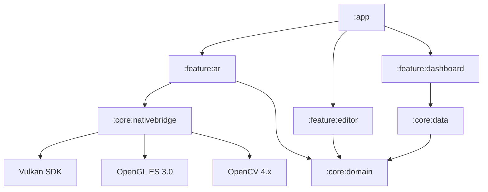

# GraffitiXR Architecture

## High-Level Overview

GraffitiXR follows a multi-module Clean Architecture pattern, optimized for high-performance native rendering and local-first data persistence.



**Feature modules must not depend on other feature modules.**

## Module Definitions

### `:feature:ar`
ARCore session lifecycle (`ArViewModel`), camera frame acquisition (`ArRenderer`), sensor fusion, optical flow depth, and SLAM data feeding. `ArRenderer` renders the camera background via `BackgroundRenderer`; `GsViewer` (in `:feature:editor`) renders SLAM splats above it via Vulkan.

### `:feature:editor`
Mural preparation tools. Layer hierarchy, image manipulation, `GsViewer` (`SurfaceView` + Vulkan).

### `:core:nativebridge`
C++17 MobileGS engine and JNI boundary (`GraffitiJNI.cpp`). Handles voxel hashing, Gaussian splatting, optical flow depth, DEPTH16 decoding, and Vulkan/OpenGL rendering.

## Data Flow (AR Pipeline)

Each ARCore tracking frame in `ArRenderer.onDrawFrame`:

```
camera.imageIntrinsics + camera.pose ──► setCameraMotion(fxPx, translationM)
                                              │
frame.acquireCameraImage() [Y-plane] ────────► feedMonocularData()
                                              │  └─ optical flow → processDepthFrame()
frame.acquireDepthImage16Bits() ─────────────► feedArCoreDepth()
                                              │  └─ DEPTH16 decode → processDepthFrame()
camera.getViewMatrix/ProjectionMatrix ───────► updateCamera()
                                              │
                                    MobileGS::processDepthFrame()
                                              │
                            ┌─────────────────┴──────────────────┐
                     BackgroundRenderer                     GsViewer (Vulkan)
                  (camera feed, GLSurfaceView)         (voxel splats, SurfaceView)
```

**Camera ownership:**
- `EditorMode.AR` → ARCore `Session` owns camera; CameraX is inactive
- `EditorMode.OVERLAY` → CameraX owns camera; ARCore `Session` is paused
- `DisposableEffect` in `ArViewport` manages mode-level transitions; `MainActivity.onResume/onPause` manages activity-level lifecycle

## Teleological Correction

OpenCV fingerprinting compares the current camera frame against a stored reference fingerprint. On match, `slamManager.updateAnchorTransform()` corrects accumulated drift in the global map transform.
