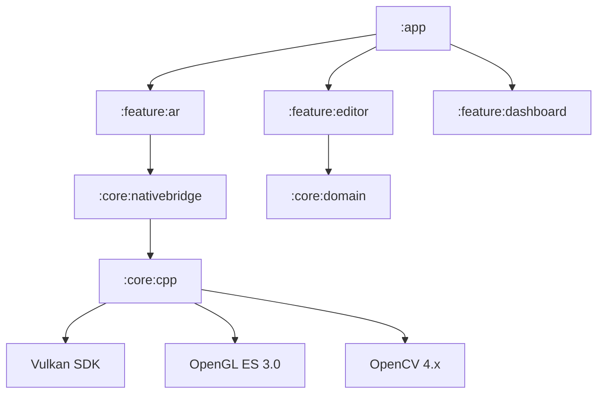

# GraffitiXR Architecture

## High-Level Overview

GraffitiXR follows a multi-module Clean Architecture pattern, optimized for high-performance native rendering and local-first data persistence.

## Module Definitions

### feature:ar
Responsible for ARCore session management, camera frame acquisition, and sensor fusion. It feeds raw depth and image data into the native engine.
- **Key Component:** `ArRenderer.kt` - Orchestrates the AR loop, light estimation, and mesh generation.
- **Key Component:** `MeshGenerator.kt` - Converts LiDAR depth maps into occlusion meshes.

### feature:editor
Provides tools for mural preparation.
- **Key Component:** `WarpableImage.kt` - Implements 3x3 Mesh Warp for projective geometry corrections.

### core:nativebridge
The JNI boundary. Handles memory management (DirectByteBuffers) and ensures robust lifecycle transitions between Kotlin and C++.
- **Key Component:** `SlamManager.kt` - Singleton managing the native engine handle.

### core:cpp (MobileGS)
The heart of the application. A C++17 engine implementing:
- **3D Gaussian Splatting:** High-fidelity point cloud rendering.
- **Voxel Hashing:** Efficient spatial mapping of the environment.
- **Teleological Loop:** Auto-alignment via solvePnP.
- **Vulkan Backend:** Hardware-abstracted rendering pipeline.

## Data Flow (Teleological Loop)
1.  **Observation:** Camera captures environment.
2.  **Estimation:** ARCore provides 6DOF pose.
3.  **Correction:** OpenCV matches current frame against stored fingerprint.
4.  **Alignment:** Native engine updates global map transform to minimize drift.

## Rendering Pipeline
1.  **Depth Pass:** Render LiDAR/Stereo mesh to depth buffer (Occlusion).
2.  **Splat Pass:** Draw Gaussian Splats with additive blending and depth testing.
3.  **Composite:** Overlay 2D UI and layers.
