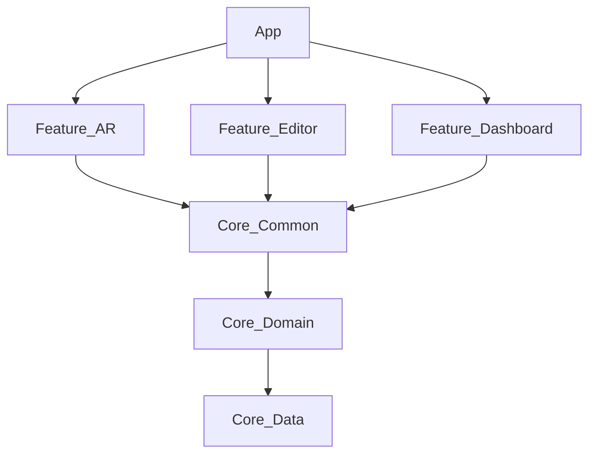

# Architecture & State Management

## The Unified State Pattern

To resolve circular dependencies between feature modules (e.g., `feature:editor` needing AR data and `feature:ar` needing Editor context), we pulled all state definitions into **`:core:common`**.

### Source of Truth
The `UiState.kt` file in `:core:common` is the single source of truth for the application's data flow.

#### 1. `EditorUiState`
Controls the artistic workspace.
* **Layers:** A list of `Layer` objects containing bitmap data, transforms (scale/rotation), and blending modes.
* **Mode:** The active operational mode (`AR`, `STATIC`, `TRACE`).
* **Background:** The reference image (`backgroundBitmap` or `mapPath` for 3D).

#### 2. `ArUiState`
Controls the computer vision session.
* **Tracking:** Point cloud density and plane detection status.
* **Target Creation:** Buffers for `tempCaptureBitmap` and the rectification flow (`capturedTargetUris`).

## Data Flow

1.  **Events:** UI Components (in `:feature`) fire events to their ViewModel.
2.  **Mutation:** ViewModels (`MainViewModel`, `EditorViewModel`) mutate the StateFlow.
3.  **Observation:** The UI observes the Unified State from `:core:common` and recomposes.

## Module Graph
# Architecture

## Module Graph



The "Unified State" Pattern
We do not use isolated states per feature. We use a monolithic state object split by domain, residing in :core:common.

UiState.kt
EditorUiState:

layers: List of bitmaps and transforms.

editorMode: Controls the view strategy (AR, STATIC, TRACE).

mapPath: (New) Path to the 3D map/splat file for the 3D Mockup mode.

backgroundBitmap: Fallback 2D background.

ArUiState:

isScanning: (New) Controls the SLAM mapping session state.

pointCloudCount: Debug metric for SLAM quality.

capturedTargetUris: For the Surveyor flow.

Key Components
:feature:ar
ArRenderer: Manages the GL surface and ARCore session.

SlamManager: (New) Handles keyframe extraction and point cloud generation.

:feature:editor
GsViewer: (New) A dedicated surface for rendering Gaussian Splats.

MockupScreen: Switches between 2D Image composables and the 3D GsViewer based on EditorUiState.mapPath.
```

---

### 3. `docs/PIPELINE.md`
**Status:** Updated to match the `TargetCreationFlow` code in `feature:ar`.

# AR & Vision Pipeline

## Target Creation Flow

GraffitiXR allows users to create custom Augmented Images (Targets) on the fly.

### 1. Capture (`CaptureStep.CAPTURE`)
* **Input:** Camera feed via `ArRenderer`.
* **Action:** User taps "Capture".
* **Output:** A raw bitmap frame (`tempCaptureBitmap`) stored in `ArUiState`.

### 2. Rectification (`CaptureStep.RECTIFY`)
* **Input:** The raw bitmap.
* **Process:**
    1.  User defines 4 corner points (homography).
    2.  `ImageProcessor.unwarpImage` (OpenCV) flattens the perspective.
* **Output:** An orthogonal (flat) image of the wall/surface.

### 3. Review & Save (`CaptureStep.REVIEW`)
* **Action:** User confirms the unwarped image.
* **Persistence:**
    1.  Image saved to local cache/storage.
    2.  URI added to `capturedTargetUris`.
    3.  ARCore Augmented Image Database updated dynamically.

## Rendering

* **Engine:** OpenGL ES 3.0.
* **Shader Pipeline:** Custom shaders for camera background, point clouds, and transparent layer compositing.
* **Occlusion:** Depth API enabled for masking virtual objects behind physical ones.


---

### 4. `docs/ROADMAP.md`
**Status:** Updated to reflect that SLAM and 3D Mockups are now active features.

```markdown
# Roadmap

## Phase 1: Foundation (Completed)
- [x] Multi-module project structure setup.
- [x] ARCore integration with basic plane detection.
- [x] Jetpack Compose UI with `AzNavRail`.
- [x] Unified State Architecture implementation.

## Phase 2: Core Editing (Completed)
- [x] Layer System (Add, Remove, Reorder).
- [x] Blend Modes (Multiply, Overlay, Screen, etc.).
- [x] Trace Mode (High contrast overlay).
- [x] Target Creation Flow (Capture -> Rectify).

## Phase 3: 3D & SLAM (Current Focus)
- [x] **SphereSLAM:** Basic keyframe and point cloud capture (`MappingScreen`).
- [x] **3D Mockup:** Integration of `GsViewer` into the Editor.
- [ ] **Splat Training:** On-device training of Gaussian Splats from SLAM data (Currently offline/cloud only).
- [ ] **Live Occlusion:** Using the sparse point cloud for real-time occlusion in AR mode.

## Phase 4: Polish & Scaling
- [ ] **Cloud Anchors:** Multi-user sessions.
- [ ] **LiDAR:** Mesh generation for Pro devices.
- [ ] **Optimizations:** Vulkan backend for Splat rasterization.
