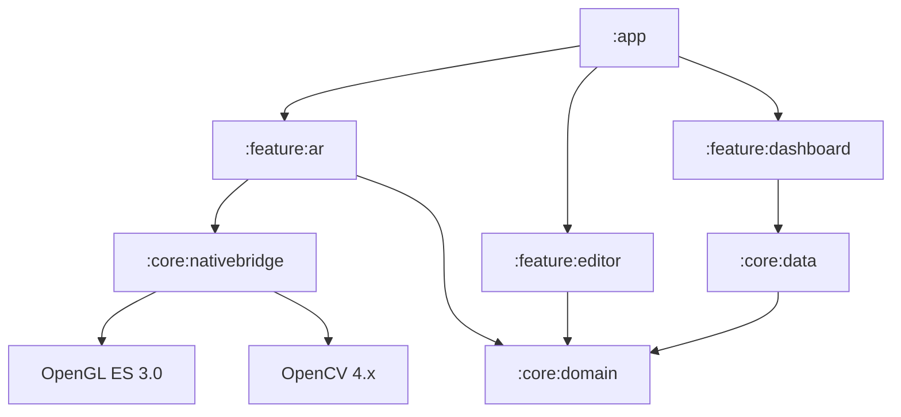

# GraffitiXR Architecture

## High-Level Overview

GraffitiXR follows a multi-module Clean Architecture pattern, optimized for high-performance native rendering and local-first data persistence.


```mermaid
graph TD
    App[":app"] --> FeatureAR[":feature:ar"]
    App --> FeatureEditor[":feature:editor"]
    App --> FeatureDash[":feature:dashboard"]

    FeatureAR --> CoreNative[":core:nativebridge"]
    FeatureAR --> CoreDomain[":core:domain"]
    FeatureEditor --> CoreDomain
    FeatureDash --> CoreData[":core:data"]

    CoreNative --> GLES[OpenGL ES 3.0]
    CoreNative --> OpenCV[OpenCV 4.x]
    CoreData --> CoreDomain
```

**Feature modules must not depend on other feature modules.**

## Module Definitions

### `:feature:ar`
ARCore session lifecycle (`ArViewModel`), camera frame acquisition (`ArRenderer`), sensor fusion, and SLAM data feeding. `ArRenderer` renders the camera background via `BackgroundRenderer` and calls `slamManager.draw()` for SLAM splat rendering via OpenGL ES 3.0.

### `:feature:editor`
Mural preparation tools. Layer hierarchy, image manipulation.

### `:core:nativebridge`
C++17 MobileGS engine and JNI boundary (`GraffitiJNI.cpp`). Handles voxel hashing, Gaussian splatting, DEPTH16 decoding, and OpenGL ES 3.0 rendering.

## Data Flow (AR Pipeline)

Each ARCore tracking frame in `ArRenderer.onDrawFrame`:

```
camera.trackingState ────────────────────────► setArCoreTrackingState(isTracking)
frame.acquireCameraImage() [RGBA] ───────────► feedColorFrame()   (relocalization / fingerprinting)
frame.acquireDepthImage16Bits() ─────────────► feedArCoreDepth()
                                              │  └─ DEPTH16 decode → processDepthFrame()
camera.getViewMatrix/ProjectionMatrix ───────► updateCamera()
                                              │
                                    MobileGS::processDepthFrame()
                                              │
                            ┌─────────────────┴──────────────────┐
                     BackgroundRenderer                   slamManager.draw()
                  (camera feed, GLSurfaceView)       (voxel splats, same GLSurfaceView)
```

**Camera ownership:**
- `EditorMode.AR` → ARCore `Session` owns camera; CameraX is inactive
- `EditorMode.OVERLAY` → CameraX owns camera; ARCore `Session` is paused
- `DisposableEffect` in `ArViewport` manages mode-level transitions; `MainActivity.onResume/onPause` manages activity-level lifecycle

## Teleological Correction

OpenCV fingerprinting compares the current camera frame against a stored reference fingerprint. On match, `slamManager.updateAnchorTransform()` corrects accumulated drift in the global map transform.


---
*Documentation updated on 2026-03-17 during website redesign and Stencil Mode integration phase.*
