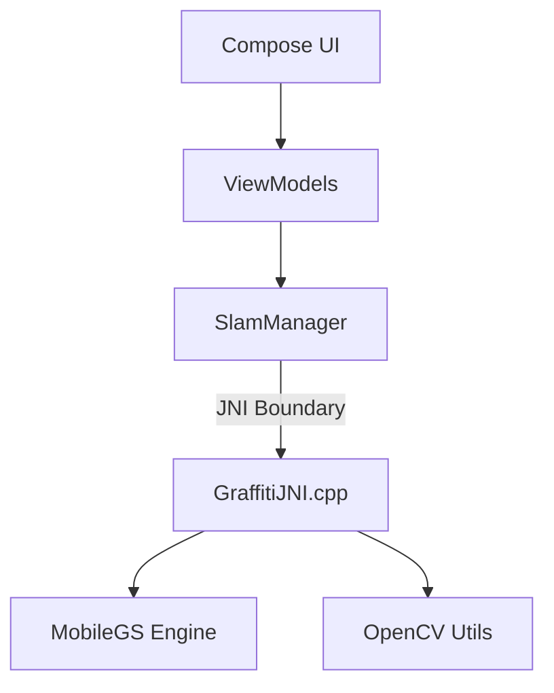

# GRAFFITIXR ARCHITECTURE

## Philosophy
GraffitiXR is a "Thick Client" implementation. The logic lives on the device. The cloud is non-existent.

## High-Level Structure
The application follows a standard **MVVM (Model-View-ViewModel)** pattern on the Android side, bridging into a **Custom Engine (MobileGS)** for the heavy lifting.

The Native Bridge (Unified)
Previously a split system, the native bridge is now consolidated into a single pipeline.

1. The Kotlin Gatekeeper: SlamManager
   Location: core/nativebridge/src/main/java/com/hereliesaz/graffitixr/nativebridge/SlamManager.kt

Role: The Singleton source of truth. It manages the C++ pointer (nativeHandle).

Responsibility:

Initializing/Destroying the C++ engine.

Feeding Camera Frames (Depth/Color) to the SLAM system.

Exposing StateFlows (e.g., mappingQuality) to the UI.

Providing utility functions for OpenCV features (ORB extraction).

2. The C++ Implementation: GraffitiJNI.cpp
   Location: core/nativebridge/src/main/cpp/GraffitiJNI.cpp

Role: The translator.

Responsibility:

Converts Java objects (ByteBuffers, Arrays, Bitmaps) into C++ structures (cv::Mat, pointers).

Calls methods on the MobileGS instance.

3. The Engine: MobileGS
   Location: core/nativebridge/src/main/cpp/MobileGS.h

Role: The brain.

Responsibility:

Tracking: Teleological SLAM (tracking against the future painting).

Mapping: Gaussian Splatting storage and rendering.

Keyframing: Managing the Voxel Confidence Map.

Data Flow
The AR Loop
ARCore provides a Frame.

ArRenderer extracts the Image (YUV/Depth) and Camera Pose.

SlamManager.feedDepthData() is called with raw ByteBuffers.

JNI locks the buffers and passes pointers to MobileGS.

MobileGS updates the splats.

ArRenderer calls SlamManager.draw().

MobileGS renders the splats directly to the GL Surface.

The Editor Loop (Image Processing)
User selects an image.

EditorViewModel loads the Bitmap.

SlamManager.extractFeatures(bitmap) is called.

JNI converts Bitmap to cv::Mat (Grayscale).

OpenCV runs ORB detection.

Descriptors are returned as ByteArray to Kotlin.