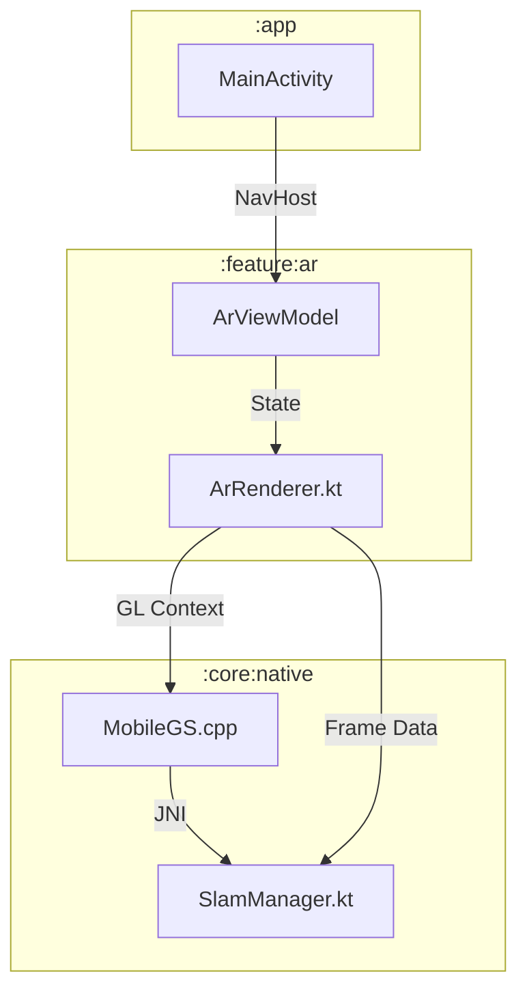

# Architecture & Rendering Pipeline

## Module Architecture (Clean Architecture)
The application is structured into three layers, now including a dedicated Native module:

1.  **App Layer (`:app`)**: Entry point, Dependency Injection (Hilt/Manual), Navigation.
2.  **Feature Layer**:
    *   `:feature:ar`: Core AR logic, Renderer, ViewModels.
    *   `:feature:editor`: Image manipulation tools, UI for editing.
    *   `:feature:dashboard`: Project management, Settings, Onboarding.
3.  **Core Layer**:
    *   `:core:domain`: Pure Kotlin data models, Repository interfaces (use cases).
    *   `:core:data`: Repository implementations, File I/O, Database.
    *   `:core:common`: Shared utilities, State classes (`UiState`), Extension functions.
    *   `:core:design`: UI Components (Compose), Themes, Typography.
    *   `:core:native`: **[NEW]** C++ Engine (`MobileGS`) and JNI bindings.

## System Diagram

## Rendering Pipeline (The "Brain")

The rendering loop in `ArRenderer.kt` is the heartbeat of the application.

1.  **Input**: ARCore provides a `Frame` (Camera Image + Depth Map + Pose).
2.  **Processing**:
    *   **Background**: The camera image is rendered to a texture.
    *   **Native Sync**: The Depth Map and Pose are passed to `MobileGS.cpp` via `SlamManager`.
    *   **Logic**: `MobileGS` updates the voxel grid (Sparse Voxel Hashing).
3.  **Output**:
    *   **Native Draw**: `MobileGS` draws the point cloud/splats directly to the OpenGL surface.
    *   **Overlay Draw**: `ArRenderer` draws user content (layers) on top.

## Data Persistence (.gxr)
Projects are saved as ZIP containers.
*   **Map Data**: Serialized by `MobileGS::saveModel` (binary voxel dump).
*   **Metadata**: JSON (using `kotlinx.serialization`).
*   **Images**: Standard JPG/PNG.
